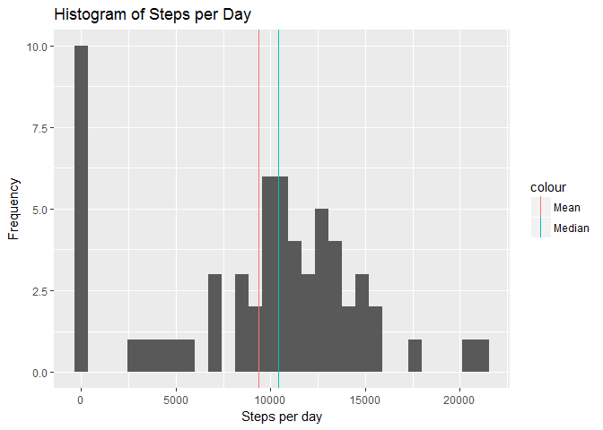
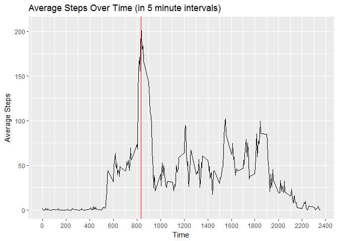
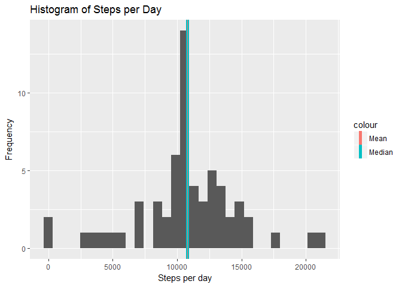
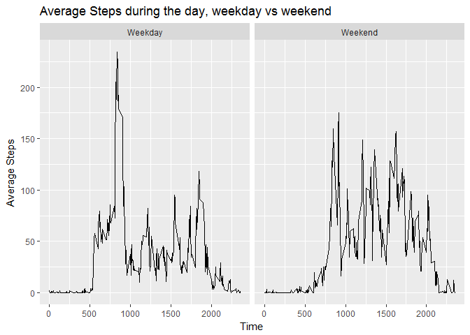

# Reproducible Research Project 1
DRWatkins  

### Requirements

This script requires two packages: ggplot2 and data.table


```r
require(data.table)
```

```
## Loading required package: data.table
```

```r
require(ggplot2)
```

```
## Loading required package: ggplot2
```

## Loading and preprocessing the data

The script first checks to see if the dataset exists in the working directory. If not, it downloads the file and unzips it. It reads the .csv file into a data table variable named step, then converts the date column into the Date data type.


```r
if(!file.exists("activity.csv")){
    download.file(
     "https://d396qusza40orc.cloudfront.net/repdata%2Fdata%2Factivity.zip",
                  destfile="repdataactivity.zip")
    unzip(zipfile="repdataactivity.zip",exdir=getwd()) }

step<-fread("activity.csv",sep=",",header=T)
step$date<-as.Date.character(step$date)
```

## What is mean total number of steps taken per day?

The number of steps taken per day can be visualized with a histogram. Note that the missing values are not used in this plot. First the script creates a new variable totsteps, a sum of the step variable grouped by date. It uses ggplot with a histogram geom to plot the data. The script also adds vertical lines to indicate the mean and median, which are included numerically after the plot.


```r
totsteps<-step[,sum(steps,na.rm=T),by=date]
names(totsteps)[2]<-"steps"
ggplot(data=totsteps,aes(steps)) + 
    geom_histogram(binwidth=21194/30) + 
    labs(x="Steps per day", y="Frequency",
         title="Histogram of Steps per Day") + 
    geom_vline(aes(xintercept=median(totsteps$steps),color="Median")) + 
    geom_vline(aes(xintercept=mean(totsteps$steps),color="Mean"))
```

<!-- -->

```r
mean(totsteps$steps)
```

```
## [1] 9354.23
```

```r
median(totsteps$steps)
```

```
## [1] 10395
```

## What is the average daily activity pattern?

The average daily activity pattern can be visualized with a time series. For this, the script creates a new aggregate variable avgsteps, then plots the time series with ggplot using a line geom. It includes a red line which indicates the time at which the maximum average steps occurs. This is included numerically after the plot.


```r
avgsteps<-step[,mean(steps,na.rm=T),by=interval]
names(avgsteps)[2]<-"steps"
ggplot(data=avgsteps,aes(x=interval,y=steps))+geom_line() +
    labs(x="Time", y="Average Steps",
         title="Average Steps Over Time (in 5 minute intervals)") +
    scale_x_continuous(breaks=seq(0,2400,200)) +
    geom_vline(aes(xintercept=avgsteps$interval[which.max(avgsteps$steps)])
               , col="red")
```

<!-- -->

```r
avgsteps[steps==max(avgsteps$steps),]
```

```
##    interval    steps
## 1:      835 206.1698
```

## Imputing missing values

The data includes many observations with missing values:

```r
sum(!complete.cases(step))
```

```
## [1] 2304
```

Imputing is a method of substituting in likely values in order to use as much of the data as possible; in this situation, the script uses the mean value of the the interval for the value that is missing.

To do this simple impute method, this script does the following:
1. Create a copy of the original data table step in variable imputedstep
2. Create a logical vector for the locations of the missing values
3. Create a vector of the averages (61 copies of the averages, ordered by interval)
4. Convert the NA values to 0, in order to be summable.
5. Add the product of the two vectors to the steps variable


```r
imputedstep<-step
missingvec<-!complete.cases(imputedstep)
avgvec<-rep(avgsteps$steps,61)
imputedstep$steps[is.na(imputedstep$steps)]<-0
imputedstep$steps<-imputedstep$steps+avgvec*missingvec
```

The result is that there is no change in mean, but the median value has risen to exactly equal the mean, seen here by overlapping vertical lines and by numeric equality.


```r
imputedtotsteps<-imputedstep[,sum(steps,na.rm=T),by=date]
names(imputedtotsteps)[2]<-"steps"
ggplot(data=imputedtotsteps,aes(steps)) + 
    geom_histogram(binwidth=21194/30) + 
    labs(x="Steps per day", y="Frequency",
         title="Histogram of Steps per Day") + 
    geom_vline(aes(xintercept=median(imputedtotsteps$steps),color="Median"),lwd=2) + 
    geom_vline(aes(xintercept=mean(imputedtotsteps$steps),color="Mean"))
```

<!-- -->

```r
mean(imputedtotsteps$steps)
```

```
## [1] 10766.19
```

```r
median(imputedtotsteps$steps)
```

```
## [1] 10766.19
```

## Are there differences in activity patterns between weekdays and weekends?

To see if there is a difference in activity patterns, the script creates a new variable called daytype, which separates factors into "Weekday" (Monday-Friday) or "Weekend" (Saturday or Sunday). It creates a new aggregate data set which groups by daytype and time interval. Finally, the script uses ggplot to plot a time series using a line geom, with facets for the daytype variable.


```r
step$daytype<-as.factor(weekdays(step$date) %in% c("Saturday","Sunday"))
levels(step$daytype)<-c("Weekday","Weekend")
avgwksteps<-step[ ,mean(steps, na.rm=T),by=list(daytype, interval)]
names(avgwksteps)[3]<-"steps"

ggplot(data=avgwksteps, aes(x=interval,y=steps)) + geom_line() +
    facet_wrap(~daytype) +
    labs(x="Time", y="Average Steps",
         title="Average Steps during the day, weekday vs weekend")
```

<!-- -->

We can see that there are significant differences in the two plots. Weekday activity is higher during the morning hours (minutes 500-1000), but weekend activity is consistently higher from late morning to afternoon (1000-1700).
